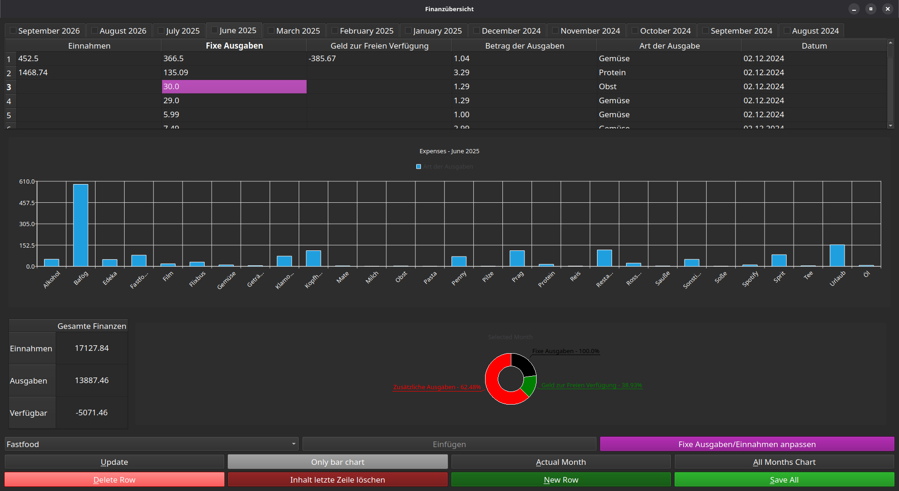
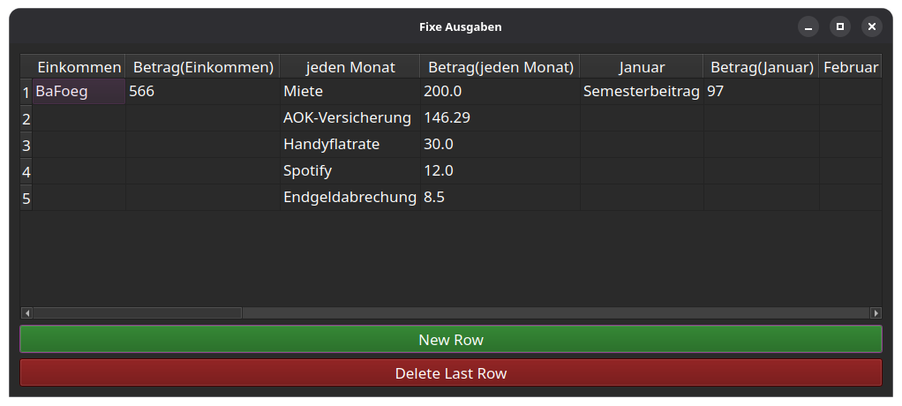

# financial_overview



Eine moderne Desktop-Anwendung zur Verwaltung persönlicher Finanzen, Einnahmen und Ausgaben, entwickelt mit Python und PyQt6.

## Project Structure

```text
financial_overview/
├── images/                # Ordner für Bilder aus der Programmnutzung
├── csv/                   # Ordner für die monatlichen CSV-Finanzdaten
├── archive/               # Alter Code / Backups
├── main.py                # Hauptfenster, UI-Layout und App-Einstiegspunkt
├── tab_manager.py         # Verwaltung, Laden und Erstellung der monatlichen Tabs
├── chart_helpers.py       # Logik für Balken- und Kreisdiagramme (ChartHelper)
├── data_handler.py        # CSV-Lade- und Speicherfunktionen
├── monthly_conditions.py  # Konfiguration für fixe Einnahmen und Ausgaben
├── custom_widgets.py      # Benutzerdefinierte Widgets (Worksheets, TabButton)
├── ui_helpers.py          # UI-Hilfsfunktionen (z. B. Tabelleneinstellungen)
├── utils.py               # Allgemeine Hilfsfunktionen (Berechnungen, Ausrichtung)
├── my_chart.py            # Angepasste Chart-Klassen für die Kreisdiagramme
├── second_window.py       # Zweites Fenster zum Anpassen fixer Bedingungen
└── README.md              # Projektdokumentation
```

## Features 

- **Monatsbasierte Tabs:** Verwaltung der Finanzen in separaten Tabs für jeden Monat.
- **Interaktive Diagramme:** Visualisierung von Ausgaben als Balken- und Kreisdiagramme (mittels PyQtCharts).
- **Fixkosten-Verwaltung:** Automatisches Hinzufügen von fixen Einnahmen und Ausgaben über anpassbare Bedingungen.

- **CSV-Datenexport/-import:** Deine Daten werden lokal sicher in CSV-Dateien gespeichert.
- **Kategorisierung:** Schnelles Zuordnen von Ausgaben über vordefinierte Kategorien.

## Installation & Start

1. Repository klonen oder herunterladen:
   ```bash
   git clone https://github.com/Zimon64/financial_overview.git
   cd Finanzenübersicht